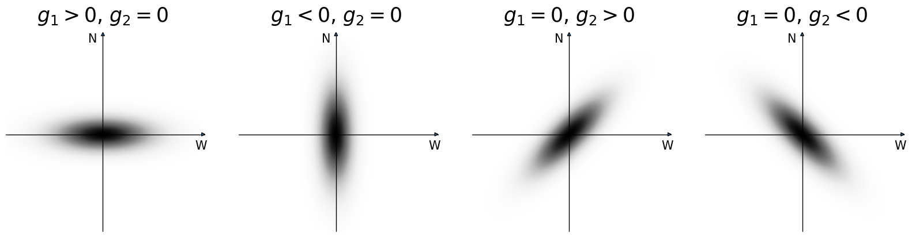

Shear Conventions
=================

A shear field (or in general an arbitrary spin-2 complex field, also known as a "spinor")
is described by two real numbers in the input `Catalog`, called :math:`g_1` and :math:`g_2`.
The complex-valued :math:`g` is defined as:

.. math::

    g = g_1 + i g_2 = |g| e^{2 i \phi}

These values are used in all "G" correlation function classes: `GGCorrelation`,
`NGCorrelation`, `KGCorrelation`, and `GGGCorrelation`.

Spin-2 fields have the property that when the coordinate system rotates by an angle
:math:`\theta`, the complex value changes by a factor of :math:`\text{exp}(-2 i \theta)`.
That is, they transform as an ellipse or a "headless" line segment (where neither end is special,
unlike a vector). When the coordinates are rotated by 180 degrees, the ellipse or line segment
is mapped back onto itself, and the shear value is unchanged.

Flat Geometries
---------------

For flat two-dimensional geometries, the definition of the shear phase
is fairly non-controversial.
The standard definition holds that :math:`g` is positive real when the
shear is oriented parallel to the x-axis.  It is negative real when parallel to
the y-axis.  It is positive imaginary when parallel to the line :math:`y=x`.
And it is negative imaginary when parallel to the line :math:`y=-x`.

.. image:: xy_shear.png

In other words, the phase angle :math:`\phi` is measured counter-clockwise from the
x-axis.

Spherical Geometries
--------------------

For spherical or 3-d geometries, things get somewhat more complicated, because there is
no consistent orientation that would work for all locations on the sphere.
At the location of any particular galaxy, one can define a local rectilinear coordinate system
where the shear is defined analogously to the flat geometry case, but these necessarily change as
one moves around the celestial sphere.

TreeCorr uses the convention adopted by many recent weak lensing surveys, that the
"up" direction is towards the north pole.  As seen from Earth, this means that West is
to the right.  The measurement of the ellipticity of a galaxy involves rotating the
local coordinates in the neighborhood of the galaxy such that north is oriented
vertically, and then measuring the ellipticity in the normal way.

With this convention, :math:`g` is positive real when the shear is oriented
in the local E-W direction.  It is negative real when oritented in the N-S direction.
It is positive imaginary when oriented along NW-SE.  And it is negative imaginary
when oriented along NE-SW.

Options to adjust the convention
--------------------------------

Not all surveys and simulations conform to the above convention, particularly related
to the sign of the two components.  The most common alternative is to align the axes
with north still up, but as seen from space looking along the path of the light bundle
as it travels towards Earth.  This flips the E and W directions, so West is to the
left, not right.  The upshot of this choice is that it flips the sign of the imaginary
component, g2.  Sometimes simulations choose conventions that are equivalent to flipping
the sign of g1, either instead of or in addition to flipping g2.

Because of this variation in conventions, TreeCorr provides two input parameters to
flip the sign of either component to match the standard convention.
Setting ``flip_g1=True`` when making a `Catalog` will cause it to flip the sign of all
the g1 values.  Similarly, ``flip_g2=True`` will flip the sign of all the g2 values.
